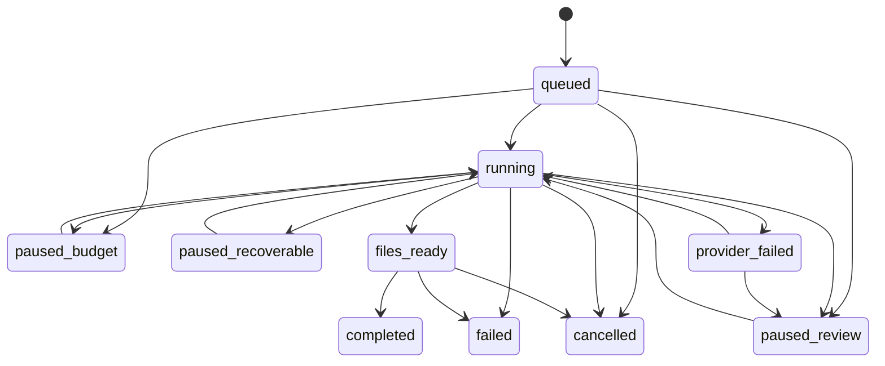

# Production Studio Automatic Lifecycle

This document covers the guarded automation foundation for HeroKid Production Studio.

Automation is an optional layer over the existing manual Studio workflow. It does not modify checkout, public pages, payment, delivery, customer order status, the global `stories` record, or the current manual Studio controls.

## Feature Flags

```env
HERO_KID_PRODUCTION_STUDIO_ENABLED=true
HERO_KID_PRODUCTION_STUDIO_AUTOMATION_ENABLED=false
QUEUE_CONNECTION=database
HERO_KID_AUTOMATION_SCENE_CONCURRENCY=2
HERO_KID_AUTOMATION_JOB_TIMEOUT=300
HERO_KID_AUTOMATION_JOB_TRIES=1
HERO_KID_AUTOMATION_JOB_BACKOFF=30,90,180
HERO_KID_AUTOMATION_STALE_MINUTES=15
```

`HERO_KID_PRODUCTION_STUDIO_AUTOMATION_ENABLED=false` prevents new automation runs, resume operations, retries, and new automation provider submissions. Historical runs remain inspectable and cancellable by authorized admins.

## Architecture

Core tables:

- `production_automation_runs`: one orchestration run for one `production_projects` row.
- `production_automation_steps`: ordered lifecycle steps, including independent scene steps.
- `production_automation_attempts`: provider/manual attempts with run version and input fingerprints.
- `production_automation_cost_entries`: reservation ledger for reserved, incurred, released, and unknown exposure.

Automation metadata columns are also available on image jobs, generated assets, and print layouts:

- `production_automation_run_id`
- `production_automation_step_id`
- `production_automation_attempt_id`
- `input_fingerprint`
- `output_fingerprint`
- `validation_policy_version`

Phase 2 also stores automation metadata on production-specific story drafts and character profiles. The global `stories` row remains immutable during automation.

Existing reusable components remain the integration points:

- Story workspace: `production_story_versions`, `production_scenes`, `ScenePersonalizationService`.
- Character analysis: `OpenAiTextVisionProvider`.
- Image generation: `CreateGenerationJobAction`, `SubmitAiGenerationJob`, `PollAiGenerationJob`.
- Identity review: `IdentityReviewDispatcher`, `ProductionAutomationIdentityValidator`.
- Scene approval: existing asset approval actions.
- Layout and print: `ProductionLayoutBuilder`, `GenerateProductionLayoutJob`.
- Audit logging: `ProductionStudio::log`.

## State Diagram



Terminal run statuses are `completed`, `cancelled`, and `failed`. `files_ready` is not terminal because final human proof is still required.

Step statuses are:

`pending`, `queued`, `running`, `waiting_review`, `completed`, `skipped`, `failed_recoverable`, `provider_failed`, `failed`, `cancelled`.

All run and step transitions go through `ProductionAutomationStateMachine`. Duplicate transitions are idempotent and audited. Invalid transitions throw safely.

## Progress Formula

Progress is derived from validated completed steps, not queued work:

- Preflight: 5
- Story preparation: 15
- Character profile: 10
- Child reference: 10
- Cover: 5
- Thirteen scenes total: 35
- Layout and print: 15
- Final proof: 5

Queued, running, failed, or waiting-review steps do not count. `files_ready` is always 95%. Final proof confirmation moves the run to 100%.

## Phase 2 Lifecycle

Phase 2 is implemented in `ProductionAutomationPhase2Service` and is advanced only through `AdvanceProductionAutomationRun`. Each invocation locks the run, refreshes persisted records, checks compatible fingerprints, starts at most the next eligible job, then exits quickly.

Phase 2 covers only preflight, story preparation, character profile, and child reference generation/validation. When child reference approval completes, the next lifecycle step is `cover`. Historical Phase 2-complete runs that were paused with `safe_failure_code=phase2_complete_ready_for_phase3` now resume idempotently into Phase 3. Runs paused for real validation, budget, security, cancellation, or manual-review blockers do not auto-resume.

### Preflight

Preflight validates feature flags, project/order/story readiness, private readable child photos, database queue configuration, private storage writability, active OpenAI text/vision models, active image and premium fallback models, one-active-run enforcement, and Phase 2 base budget. It never submits provider requests.

The immutable run snapshot stores selected model codes, provider/model pricing, style, quality, retry limits, validation threshold, prompt/fingerprint/validation-policy versions, hard budget, selected photo indices, child-photo hashes, and story template content hash.

### Story Preparation

Story preparation creates or reuses a `production_story_versions` draft. The global `stories` row is never modified.

The OpenAI scene extraction call uses a strict schema requiring exactly thirteen scenes. Each scene must include `scene_number`, `written_text`, `visual_direction`, `child_action_pose`, `environment`, `mood_lighting`, `supporting_characters`, `key_objects`, `continuity_notes`, `safe_text_area_notes`, and `educational_value`.

`ScenePersonalizationService` verifies high-confidence template hero replacement and detects old-hero references across scene fields. Malformed output, missing fields, ambiguous hero detection, old-hero residue, or conflicting child identity pauses the run for review without partially applying the result.

Manual story approval requires exactly thirteen usable production scenes. It records actor and reason, recalculates fingerprints, completes the story step through the state machine, and resumes orchestration.

### Character Profile

Character profile analysis uses only selected private child photos. The request is sent after a cost reservation and carries run id, step id, attempt id, run version, orchestration generation, provider metadata, and input fingerprint.

The strict schema includes appearance summary, hair details, skin tone, eyes and visible traits, usual expression, face/body notes, identity rules, negative instructions, confidence notes, field-level confidence, reference recommendations, and warnings.

Warnings, missing required fields, low/unavailable confidence for required identity fields, unclear photos, multiple-child evidence, contradictory photos, or malformed output pause for human review. Raw image data, signed URLs, private prompts, and raw provider payloads are not exposed in status or logs.

Manual profile correction updates the production character profile only, records actor and reason, recalculates fingerprints, and resumes from the character-profile boundary.

### Child Reference

Child reference generation creates a new immutable `character_sheet` asset version for each attempt. It uses the approved production story fingerprint, approved character profile fingerprint, selected style/quality, prompt version, selected model, and validation policy as fingerprint inputs.

Retry order:

1. First attempt on the selected generation model.
2. One same-model retry with an improved prompt.
3. One premium fallback attempt.

Each generation and validation request has its own ledger reservation. Fallback is not submitted until the previous attempt has finalized as failed or rejected. Hard-budget checks are atomic, so concurrent workers cannot reserve beyond the budget.

After image generation, `IdentityReviewDispatcher` creates an independent structured validation job using the configured OpenAI vision validator. Validation criteria cover age consistency, face structure, hair, skin tone, eyes, accessories, presentation, number of children, unrelated characters, adult-looking child, text/logos/watermarks, and safety.

Blocking flags override the score. A high score with multiple children, visible text, logos, watermarks, adult-looking child, unsafe content, unrelated people, or malformed schema fails closed. Passing validation auto-approves the asset as primary only if the attempt is still current, fingerprints match, the run is still running, and the ledger has finalized.

Manual child-reference approval or rejection records actor and reason. Approval makes the selected immutable version primary; rejection preserves the asset and resumes/retries where allowed.

## Phase 3 Lifecycle

Phase 3 is implemented in `ProductionAutomationPhase3Service` and is advanced only through `AdvanceProductionAutomationRun`. It reuses the Phase 1 state machine, attempts, cost ledger, fingerprint helper, late-result guard, provider jobs, identity-review dispatcher, audit logger, feature flags, and aggregated status endpoint.

Phase 3 covers:

- cover generation and independent validation
- scene completion/preparation
- controlled scene image generation
- independent scene validation
- retry and premium fallback
- manual cover/scene review actions

It does not generate layout files, reader PDFs, imposed A3 PDFs, manifests, proof files, print jobs, shipping actions, or order-status changes.

### Phase 2 To Phase 3 Transition

The old temporary boundary was:

```text
status=paused_review
safe_failure_code=phase2_complete_ready_for_phase3
current_step_key=cover
```

`AdvanceProductionAutomationRun` now treats that exact pause as a migration-safe bridge. It transitions the run back to `running`, clears the temporary blocker, keeps the current step at `cover`, and lets Phase 3 continue. The transition is idempotent and uses the state machine, so duplicate queue delivery or repeated resume clicks are safe.

### Cover Lifecycle

The cover input fingerprint includes the approved production story version and title, character profile fingerprint, approved child-reference fingerprint, cover prompt/template version, model/provider, style, quality, portrait orientation, and validation policy.

Cover attempt order:

1. Selected cover model.
2. One same-model retry with validation-informed prompt notes.
3. One premium fallback attempt.

Each cover attempt creates a new immutable `cover_image` asset version and a separate attempt record. The cover image is never overwritten. Provider submission happens only after an atomic ledger reservation. A new cover attempt is not submitted while a previous cover request is queued, processing, or not conclusively finalized.

Independent cover validation uses the OpenAI vision/text validator with a strict Phase 3 schema. It records:

- identity score and identity criteria
- story relevance score
- age, face, hair, skin tone, eyes, accessories, presentation
- correct number of children
- no unrelated people
- no adult-looking child
- cover composition
- portrait orientation
- safe crop and trim area
- no visible text, logos, or watermarks
- safe content

Blocking flags override scores. A cover with high scores but generated text, two children, adult-looking child, unsafe content, wrong orientation, logo, watermark, or unsafe crop fails. Malformed validation output fails closed. A cover auto-approves only when the attempt is current, fingerprints match, the run is still running, the schema passes, thresholds pass, no blocking flag exists, and cost reconciliation is complete.

If all automatic cover attempts fail, the run pauses for manual review with sanitized failure details.

### Scene Preparation

Before scene images are generated, every scene must be exactly numbered 1 through 13 and must include usable structured fields:

- scene number
- story text
- visual direction
- child action/pose
- environment
- mood/lighting
- supporting characters
- key objects
- continuity notes
- personalization
- safe text area notes
- landscape composition expectations

Complete compatible scenes are not rewritten. If a scene is missing safe-to-complete fields, Phase 3 creates a small `scene_improvement` structured text job, reserves its text cost, and applies the result only when the strict schema is complete. Old template hero references, child identity conflicts, malformed output, scene number gaps/duplicates, or unsafe ambiguity pause the affected scene for manual review while other eligible scenes can continue.

The global `stories` row is never modified.

### Scene Fan-Out/Fan-In

Scene image generation uses persisted fan-out/fan-in with a configurable concurrency limit:

```env
HERO_KID_AUTOMATION_SCENE_CONCURRENCY=2
```

The service derives active concurrency from persisted `scene_generation_jobs` with `job_type=scene_image` and status `queued` or `processing`. It does not depend on an in-memory worker counter, so it works with Hostinger cron workers running:

```bash
php artisan queue:work database --stop-when-empty
```

The orchestrator never submits all thirteen scenes at once. It fills only available slots, reserves cost before every paid request, and exits quickly. As individual scenes finish, later invocations refill open slots. One scene failure does not block unrelated eligible scenes. If no active scene jobs remain and unresolved scene review blockers exist, the run pauses with `phase3_scene_failures_need_review`.

### Scene Generation And Validation

Each scene input fingerprint includes the production story version, specific scene content hash, character profile fingerprint, approved child-reference fingerprint, scene prompt/template version, model/provider, style, quality, landscape orientation, and validation policy.

Per-scene retry order:

1. Selected generation model.
2. One same-model retry with structured validation failure notes.
3. One premium fallback attempt.

Each attempt creates a new immutable `scene_image` asset version. Only one approved fingerprint-compatible final asset may be primary for a scene. Regenerating one scene does not regenerate the cover or other scenes unless their fingerprints are incompatible.

Independent scene validation records:

- identity score
- scene adherence score
- correct child action
- correct environment
- correct story moment
- correct number of children
- no unrelated characters
- landscape composition
- safe text area
- safe crop/trim area
- no visible text, logos, or watermarks
- no adult-looking child
- safe content
- continuity where relevant

Default thresholds are `identity_score >= 85` and `scene_adherence_score >= 80`, read from configuration/snapshot where available. Blocking flags override scores. Malformed validator output fails closed.

### Phase 3 Manual Review

Manual Phase 3 endpoints:

```text
POST /admin/production-studio/{project}/automation/phase3/assets/{asset}/approve
POST /admin/production-studio/{project}/automation/phase3/assets/{asset}/reject
POST /admin/production-studio/{project}/automation/phase3/scenes/{scene}/correct
```

All require `production_studio.automation_manage`.

Manual actions validate ownership, record actor and reason, write audit logs, recalculate fingerprints, preserve old assets, and resume from the earliest affected Phase 3 step. Scene correction invalidates incompatible artwork for that scene only. Character profile or child-reference changes invalidate cover and dependent scene images when fingerprints no longer match. Manual approval does not expose or require public asset URLs.

### Phase 3 Completion Boundary

Phase 3 is complete only when:

- one approved fingerprint-compatible final cover exists
- exactly thirteen approved fingerprint-compatible final scene images exist
- every scene has one approved primary final asset
- no unresolved scene failure remains
- no active provider attempt remains
- related reservations are reconciled
- all required validations are complete

Phase 3 no longer requires human approval just to enter layout automation. Historical runs may still have the old boundary marker:

```text
status=paused_review
safe_failure_code=phase3_complete_ready_for_layout
current_step_key=layout_print
```

`AdvanceProductionAutomationRun` resumes only runs paused for this exact marker and moves them into `running/layout_print`. Runs paused for validation, budget, security, provider failure, or real manual-review blockers remain paused. The transition is idempotent and does not create duplicate layouts.

## Phase 4 Layout and Print Files

Phase 4 extends the same centralized orchestrator and uses the existing `ProductionLayoutBuilder` plus `GenerateProductionLayoutJob`. It does not introduce a second PDF renderer or alter the manual Layout & Print workflow.

### Phase 4 State Transitions

```text
paused_review + phase3_complete_ready_for_layout -> running/layout_print
running/layout_print -> running/layout_print while layout is queued/processing/validating
running/layout_print -> paused_review when prerequisites or validation fail
running/layout_print -> files_ready when all files validate
files_ready -> waiting final human proof
```

On success:

```text
status=files_ready
current_stage=quality_check
current_step_key=final_proof
safe_failure_code=phase4_files_ready_waiting_final_proof
progress=95
```

Final proof remains mandatory. Phase 4 does not mark the automation completed, does not set progress to 100%, does not print, ship, deliver, or change order status.

### Layout Preconditions

Before queuing a layout job, Phase 4 verifies:

- one approved final cover exists and is private/readable
- exactly thirteen scenes exist, numbered 1 through 13
- each scene has approved story text
- each scene has exactly one approved final image
- automation cover/scene assets have compatible fingerprints
- no queued or processing cover/scene provider work remains
- no reserved or unknown cost entries remain unreconciled
- Phase 3 cover and scene steps are completed
- mPDF is available
- private local storage is writable
- Production Studio and automation feature flags are still enabled

Failure pauses the run at `layout_print` with `layout_preconditions_failed` or a more specific blocker in the aggregated status response. Partial PDFs are not promoted and historical files are preserved.

### Reader Page Map

The approved reader structure is versioned as `herokid-reader-28-a3-side-map-v1`:

- page 1: front cover
- pages 2 and 3: scene 1 image split into right/left reader pages with configured text panel
- pages 4 and 5: scene 2
- repeat through pages 26 and 27 for scene 13
- page 28: back cover

The reader PDF is A4 portrait in normal reading order and must contain exactly 28 pages.

### A3 Imposition Map

The current builder represents the imposed booklet as one PDF page per printed A3 side. The physical output is seven duplex A3 landscape sheets folded to A4; the PDF contains 14 A3 landscape pages.

For RTL binding with short-edge duplex flip, sheet 1 is:

```text
sheet 1 front: left page 1, right page 28
sheet 1 back:  left page 27, right page 2
```

The same deterministic pairing continues inward until sheet 7. The manifest records:

```text
page_count=28
sheet_count=7
printed_sides=14
pdf_page_representation=one PDF page per printed A3 side
binding_direction=rtl
duplex_flip=short_edge
```

### Fingerprints

The Phase 4 input fingerprint includes:

- approved cover asset id, version, output fingerprint, and private content hash
- all thirteen scene ids, numbers, story-text hashes, scene hashes, approved asset versions, output fingerprints, and private content hashes
- production story draft version reference
- layout template version
- page-map version
- font package
- renderer
- page sizes
- margins and text-panel policy
- A3 imposition policy
- duplex and binding policy
- locale and RTL configuration
- DPI policy

PDF output fingerprints include validated file checksums and renderer/layout versions. Temporary paths, signed URLs, timestamps, and random request ids are excluded from input fingerprints.

### Validation

Automated validation blocks promotion when:

- any required file is missing or unreadable
- reader PDF is not a PDF or does not have 28 pages
- imposed PDF is not a PDF or does not have 14 A3 side pages
- page dimensions or orientation are wrong
- required font embedding markers are missing
- the manifest page/sheet counts are wrong
- the deterministic imposition map does not match
- a cover or scene asset is missing, duplicated, stale, or incompatible
- a scene text is missing

Validation records SHA-256, file size, page count, dimensions, renderer version, layout-template version, page-map version, input fingerprint, output fingerprint, warnings, and known human-proof items.

Arabic RTL and shaping use mPDF `autoScriptToLang`, `autoLangToFont`, and DejaVuSans. Automated checks can confirm embedded-font markers and configured RTL rendering, but final visual Arabic proofing remains a human checklist item.

DPI defaults to warning mode:

```env
HERO_KID_AUTOMATION_MIN_EFFECTIVE_DPI=180
HERO_KID_AUTOMATION_DPI_POLICY=warn
```

Set `HERO_KID_AUTOMATION_DPI_POLICY=fail` only after production art dimensions are consistently print-ready. The current mPDF/GD pipeline does not guarantee CMYK conversion, so CMYK compliance is documented as a non-automatable print check.

### Manifest and Proof Checklist

The private CSV print manifest includes project/order/run references, cover and scene asset versions, scene text hashes, reader/imposed file checksums, page count, sheet count, A3 side count, duplex setting, binding direction, page-map version, renderer, font package, validation warnings, paper recommendations, and known human-proof checks. It does not include child-photo URLs, private paths, raw prompts, provider responses, or credentials.

The proof checklist is generated as a private PDF and remains incomplete until Phase 5. It covers child identity, cover quality, scene-to-text matching, Arabic text, spelling, readability, image quality, page order, cover/back-cover placement, duplex/fold direction, margins, trim safety, missing/duplicated scenes, unintended blanks, test print, color quality, and binding readiness.

### Downloads

Signed download links are exposed only when the run is `files_ready` or later and the selected automation layout is validated. Links are short-lived signed routes and require `production_studio.layout_download`. The route rechecks project ownership, run/layout compatibility, file type, file existence, validation status, and permissions before streaming from private local storage. Status JSON never returns private storage paths.

### Recovery

Layout jobs are small and resumable. Phase 4 handles:

- duplicate advance jobs by reusing the active compatible layout
- duplicate layout jobs by ignoring already-ready layouts
- worker death during generation by re-queuing stale queued/processing/validating layouts after `HERO_KID_AUTOMATION_LAYOUT_STALE_MINUTES`
- failed validation by pausing with sanitized `layout_generation_failed`
- missing files/checksums by forcing regeneration or validation retry
- input changes by preventing incompatible layout reuse through fingerprints

Temporary output stays under private local storage. Historical ready files are not deleted by automation; each automation attempt creates a new layout version.

Phase 3 scene concurrency recovery also ignores stale queued/processing scene jobs for capacity calculations after the configured heartbeat stale threshold. It does not release cost reservations merely because a local worker timed out.

## Cost Reservation Policy

Before any paid automation provider request, the ledger must:

1. Lock the automation run.
2. Calculate projected request cost.
3. Verify `incurred + reserved + unknown + projected <= hard_budget`.
4. Create a `reserved` cost entry with an idempotency key.
5. Submit the provider request only after reservation succeeds.

After provider completion:

- Provider actual cost becomes `incurred` when available.
- Missing provider billing becomes estimated fallback.
- Unused reservation creates a `released` entry.
- Unknown billing exposure remains visible as `unknown`.
- Existing idempotency keys prevent double charging duplicate jobs or retries.

## Fingerprints

Automation fingerprints are deterministic SHA-256 hashes. They include:

- Project and order identifiers.
- Story template content hash and production story draft content fingerprint.
- Scene id, number, and scene content hash.
- Child photo path hash and private content hash.
- Character profile id and sanitized profile content hash.
- Prompt template version.
- Validation policy version.
- Layout template version.
- Model, provider, style, quality, and other explicit inputs.

Fingerprints do not include temporary signed URLs or non-deterministic timestamps. Approved old assets are not automatically reusable. An asset must have a compatible input/output fingerprint for the active run.

## Identity Validation

Identity validation is a guarded heuristic. The score is not treated as scientific proof.

The structured validation criteria are:

- age consistency
- face structure
- hair color and style
- skin tone
- eye characteristics
- glasses or distinctive accessories
- gender or presentation consistency where applicable
- correct number of children
- no unrelated characters
- no adult-looking child
- no text, logos, or watermarks
- safe content

Any blocking criterion fails the validation even when the score is high. Malformed validation output fails closed into review.

Generation and validation are separate calls. The validation prompt records the verifier model and does not use the generation prompt as evidence.

## Concurrency

Scene generation is designed for fan-out/fan-in, but the safe default is two scene jobs at a time:

```env
HERO_KID_AUTOMATION_SCENE_CONCURRENCY=2
```

Concurrency must never bypass cost reservation. Each scene reserves its projected cost before submitting to a provider.

## Late Provider Results

Provider results are guarded by:

- automation run id
- step id
- attempt id
- run version
- orchestration generation
- provider request id
- input fingerprint

If a result arrives after a pause, cancellation, replacement, manual correction, or generation change, it is recorded as late audit/cost metadata and is not applied as a primary asset.

## Status Endpoint

Use one polling endpoint:

```text
GET /admin/production-studio/{project}/automation/status
```

It returns versioned JSON with:

- run status and stage
- blockers
- progress
- timing
- scene summaries
- actions available to the current user
- cost summary only with `production_studio.automation_view_costs`
- short-lived signed downloads only when files are ready and the user has download permission

The endpoint sets an ETag based on the run version and supports conditional polling.

For Phase 2, the same endpoint includes:

- `phase2.current_step`
- preflight blockers and budget estimates
- story-preparation status, safe blocker, story version id, scene count, and safe validation summary
- character-profile readiness, warnings, and field confidence
- child-reference attempt summaries, generated version ids, validation score, blocking flags, approved asset id/version, and remaining retries
- actions available to the current user

For Phase 3, the same endpoint includes:

- `phase3.current_step`
- cover status, attempts, generated version ids, approved asset id/version, validation scores, blocking flags, and remaining retries
- scene preparation status and failed scene numbers
- per-scene status for scenes 1 through 13, primary approved asset id/version, latest asset id, attempt usage, validation scores, blocking flags, and actions
- active, queued, and processing scene request counts
- configured scene concurrency limit
- failed scene aggregation
- completion readiness before layout and print

For Phase 4, the same endpoint includes:

- `phase4.current_step`
- layout step status, layout id/version/status, template version, page-map version, renderer version, font package, and output fingerprint
- reader PDF, imposed PDF, manifest, and proof-checklist validation summaries without private paths
- page count, sheet count, imposed PDF page count, and PDF representation
- checksums, file sizes, page counts, dimensions, and embedded-font markers where appropriate
- validation errors, warnings, DPI warnings, typography notes, and non-automatable proof checks
- available signed-download actions for authorized users
- available regenerate/retry/manual-layout actions for authorized managers
- `phase4_ready` and `final_proof_pending`

It never returns raw prompts, provider payloads, private storage paths, child-photo URLs, credentials, or signed asset URLs before file readiness.

## Pause, Resume, Cancel, Retry

- Pause: recoverable manual pause.
- Budget pause: provider work must not continue until budget is changed or scope is reduced.
- Review pause: admin must correct or approve something.
- Provider failure: recoverable unless explicitly escalated to terminal failure.
- Cancel: releases active lock and leaves existing history/assets intact.
- Retry step: requires `production_studio.automation_manage`, a reason, and budget-exposure confirmation.

Manual corrections must invalidate incompatible downstream fingerprints without deleting old assets.

Phase 2 manual review endpoints:

```text
POST /admin/production-studio/{project}/automation/story-preparation/approve
POST /admin/production-studio/{project}/automation/character-profile/correct
POST /admin/production-studio/{project}/automation/child-reference/{asset}/approve
POST /admin/production-studio/{project}/automation/child-reference/{asset}/reject
```

All require `production_studio.automation_manage`.

Phase 3 manual review endpoints:

```text
POST /admin/production-studio/{project}/automation/phase3/assets/{asset}/approve
POST /admin/production-studio/{project}/automation/phase3/assets/{asset}/reject
POST /admin/production-studio/{project}/automation/phase3/scenes/{scene}/correct
```

All require `production_studio.automation_manage`.

Phase 4 manual review endpoint:

```text
POST /admin/production-studio/{project}/automation/phase4/layouts/{layout}/retry
```

It records actor and reason, preserves old files, queues a new layout version through the state machine, and does not approve final proof.

## Phase 2 Troubleshooting

- `Hard budget is below the Phase 2 base estimate`: increase the hard budget or choose lower-cost configured models before starting.
- `story_hero_conflict_unresolved`: review the production story draft and remove remaining template hero references.
- `story_scene_count_invalid`: ensure the draft has exactly thirteen scenes before manual approval.
- `character_profile_warning_requires_review`: inspect the selected private photos and manually correct the profile if the warnings are acceptable.
- `character_profile_low_confidence`: select clearer private child photos or manually complete the profile.
- `identity_blocking_flags`: inspect the generated reference version; approve manually only if the blocking flag is a validator false positive and record the reason.
- `child_reference_attempts_exhausted`: manually approve an acceptable generated version or retry the step with explicit budget-exposure confirmation.
- `phase2_complete_ready_for_phase3`: historical Phase 2 boundary. Current code resumes only this temporary pause into Phase 3 and leaves all real review/budget/security pauses untouched.

## Phase 3 Troubleshooting

- `cover_attempts_exhausted`: inspect generated cover versions, manually approve a compatible acceptable version, reject unsafe versions, or retry with explicit budget exposure confirmation.
- `scene_numbers_invalid`: fix scene numbering so the production project has exactly scenes 1 through 13.
- `scene_required_field_missing`: complete the missing structured scene field manually or allow the scene improvement job to run if the field is safe to infer.
- `scene_template_hero_conflict`: remove remaining references to the original template hero from the affected scene.
- `visual_blocking_flags`: review the validator criteria. High scores still fail when blocking flags such as text, watermark, multiple children, adult-looking child, unsafe content, or wrong composition are present.
- `visual_input_fingerprint_changed`: a manual correction or newer dependency changed the expected inputs. Preserve the stale asset for audit and regenerate or manually approve a compatible version.
- `phase3_scene_failures_need_review`: independent eligible scenes finished, but one or more scenes still require manual correction, approval, or retry.
- `hard_budget_exhausted`: increase budget or manually approve existing acceptable assets. Already-submitted provider work may still complete and must be reconciled.
- `phase3_complete_ready_for_layout`: historical Phase 3 boundary. Current code resumes only this temporary pause into Phase 4 and leaves all real review/budget/security pauses untouched.

## Phase 4 Troubleshooting

- `layout_preconditions_failed`: inspect the Phase 4 blockers in the aggregated status response. Missing cover, missing scene image, active provider work, unreconciled cost entries, or unwritable private storage must be corrected before retry.
- `approved_cover_missing`: approve a compatible final cover version before layout.
- `scene_primary_image_invalid`: ensure the affected scene has exactly one approved final image.
- `active_provider_attempts_exist`: wait for currently submitted cover/scene work to complete or let recovery reconcile stale jobs.
- `unreconciled_cost_entries_exist`: provider cost reservations are still reserved or unknown. Reconcile provider completion before files are built.
- `layout_generation_failed`: the builder or validator failed. Inspect the sanitized layout error, correct inputs, then use the Phase 4 retry action or generic step retry with a reason.
- Wrong page count, page size, orientation, missing font marker, corrupt PDF, missing scene, duplicate scene, or wrong imposition: validation fails closed and files are not downloadable as approved production files.
- DPI warnings: the file may still be downloadable when policy is `warn`, but the warning must be checked during human proof and test print.

## Phase 5 Final Human Proof

Phase 5 is human-driven. Runs enter it only after Phase 4 sets `status=files_ready`, progress is 95, `current_stage=quality_check`, and `current_step_key=final_proof`. The system never approves final proof automatically.

Eligibility requires:

- Reader PDF, imposed A3 PDF, manifest, and proof checklist exist in private storage.
- Phase 4 validation is still valid and all SHA-256 checksums match current private files.
- Layout fingerprints still match the approved story, cover, 13 scene assets, page map, renderer, fonts, and configuration.
- No Phase 1-4 provider, layout, or recovery job remains active.
- The final proof step is waiting for review.

Proof attempts are stored in `production_automation_proofs`. Each proof has an immutable `proof_version`, layout reference, input fingerprint, reviewed file checksums, checklist snapshot, physical print metadata, reviewer, decision, status, and optional private report checksum. Only one proof may be current for a run through `current_run_id`; historical passed, failed, and invalidated records are preserved.

### Checklist Schema

Every mandatory item must be answered before approval. Values are `pass`, `fail`, or `not_applicable`. `not_applicable` is rejected for mandatory items and requires a reason where it is ever allowed.

Required groups:

- Identity and Artwork: child identity across cover and scenes, age appearance, no unrelated child, no unwanted text/logos/watermarks, cover relevance, scene match, no visible generation defects.
- Story and Arabic Content: child name, title, no old template hero, spelling, punctuation, Arabic shaping, RTL direction, readability, scene pairing, no clipping or overflow.
- Page and Layout: front/back cover positions, all 13 scenes, no missing/duplicate scene, reader order, imposed order, no unintended blank page, margins, fold/trim safety, no cropped faces, orientation.
- Physical Test Print: printed from imposed A3 PDF, A3 landscape orientation, duplex direction, flip edge, folded A4 reading order, side alignment, color, dark areas, skin tones, sharp text, image resolution, cover paper, inner paper, binding/folding result.
- Final Confirmation: reader checksum, imposed checksum, manifest checksum, no replaced files after proof, reviewer confirms the package is ready for printing.

Physical proof metadata is entered manually: proof-print date, printer name/model, paper size, cover and inner paper types/GSM, duplex setting, flip edge, print quality, test copies, reviewer notes, and observed color or alignment issues. There is no printer integration.

### Approval Workflow

Approval is an authorized POST action and requires `production_studio.final_proof_review`.

Routes:

```text
POST /admin/production-studio/{project}/automation/final-proof/draft
POST /admin/production-studio/{project}/automation/final-proof
POST /admin/production-studio/{project}/automation/final-proof/{proof}/approve
POST /admin/production-studio/{project}/automation/final-proof/{proof}/reject
GET  /admin/production-studio/{project}/automation/runs/{run}/proofs/{proof}/report
```

The legacy `final-proof` POST path remains as an approval alias, but it now requires the full checklist, print metadata, and reviewed checksums. It no longer accepts a single `proof_confirmed` shortcut.

Before approval the service locks the run, reloads the current proof and layout, recalculates file checksums from private storage, verifies the proof input fingerprint, verifies every mandatory checklist item passed, verifies no prior input changed, and confirms the run is still `files_ready`. Duplicate approval of an already passed proof is idempotent.

On success:

- The final proof step transitions to completed through the state machine.
- The automation run transitions to completed with progress 100, `current_stage=print_ready`, `current_step_key=print_ready`, and `safe_failure_code=final_proof_passed_ready_for_print`.
- The Production Studio project moves only to `ready_for_print` / `print_ready`.
- The public order status, payment, printing, packing, shipping, delivery, customer notifications, and inventory are unchanged.

The successful status code is currently stored in the existing `safe_failure_code` column because earlier phases used that column for boundary reasons. UI/status logic must treat these successful boundary codes separately from failures. A future schema cleanup should add a neutral `reason_code` or `safe_status_code`.

### Rejection and Correction Mapping

Rejection requires at least one failed checklist item, an affected component, failure category, and written reason. Historical files and proof records are preserved.

Central mapping:

- `story_text` or `font_or_arabic_rendering`: return to `story_preparation` and invalidate dependent layouts.
- `cover`: return to `cover`, unset the current final cover, and invalidate dependent layouts.
- `specific_scene`: return only the affected `scene_XX`, unset that scene final image, and invalidate dependent layouts.
- `reader_layout` or `imposition`: return to `layout_print` and invalidate layout outputs.
- `duplex_or_binding` or `color_output` with `failure_category=printer_settings`: preserve valid files and allow a new physical proof attempt without regenerating PDFs.
- `image_quality`: return to the affected scene when a scene number is supplied, otherwise to cover.
- `other`: return to `layout_print`.

Rejection does not automatically submit paid provider requests. An administrator must explicitly resume or retry the affected correction flow with the existing budget and override safeguards.

### Fingerprints, Invalidation, and Recovery

A passed proof becomes invalid if story text, title, child profile, child reference, cover asset, any scene asset, page map, layout template, font configuration, renderer version, reader PDF, imposed PDF, manifest, or relevant print configuration changes.

Recovery handles:

- Draft created but UI response failed.
- Approval submitted twice.
- Approval committed but proof report generation failed.
- Proof report generated but database finalization failed.
- File checksum or input fingerprint changed during review.
- Completed run reopened after proof invalidation.

`php artisan production-automation:recover` now also regenerates missing/failed proof reports and invalidates current passed proofs whose files or fingerprints no longer match. It does not release uncertain provider reservations.

### Proof Report and Downloads

After approval the system writes an immutable private JSON proof report under private storage and records its checksum. Report generation failure is recoverable; the approval remains committed and recovery retries report generation idempotently.

The proof report includes project/order reference, automation run, proof version, reviewer, review date, layout version, reader/imposed/manifest checksums, page and sheet counts, print metadata, completed checklist, final notes, decision, and ready-for-print timestamp. It excludes child-photo URLs, raw prompts, provider payloads, credentials, private server paths, and restricted cost details.

Signed downloads are short-lived and server-authorized. The status endpoint returns a proof-report URL only when the current user has `production_studio.final_proof_review` and the report is ready. Private storage paths are never returned.

### Manual Boundary After Ready For Print

After Phase 5, automation is complete because the package is verified and ready for manual production. The following remain manual operational steps:

1. Print the approved imposed A3 file.
2. Verify printer settings.
3. Print the production copy.
4. Fold, bind, and finish.
5. Package.
6. Manually update operational order or production status through the existing workflow.

Do not automate these steps in Phase 5.

## Layout and PDF Page Map

The existing layout builder remains authoritative. See the Phase 4 section for the versioned reader and imposition maps. Files remain private under `storage/app/private/production-studio/...`.

## Privacy and Retention

Child photos, prompts, generated images, PDFs, manifests, and provider responses are private. Status APIs do not return private paths, raw prompts, raw provider payloads, credentials, or image data.

Provider retention assumptions must be treated conservatively: child photos and generated child assets are sent only through authorized server-side provider calls. Do not assume providers immediately delete inputs unless the provider contract explicitly says so.

Deletion behavior:

- Cancelling a run does not delete assets.
- Manual deletion of generated AI assets uses existing private asset deletion controls.
- Historical run metadata is retained for audit and cost reconciliation.
- Future retention automation should delete private AI assets and provider metadata only after business/legal retention approval.

## Hostinger Queue Operation

No Supervisor, Redis, daemon, or extra service is required.

Recommended cron:

```cron
* * * * * /bin/bash /home/u470070883/run-herokid-queue.sh
```

Recommended `/home/u470070883/run-herokid-queue.sh`:

```bash
#!/bin/bash
APP_DIR="/home/u470070883/domains/hero-kid.com/public_html"
PHP_BIN="/usr/bin/php"

cd "$APP_DIR" || exit 1
mkdir -p storage/logs

$PHP_BIN artisan schedule:run >> storage/logs/scheduler.log 2>&1
$PHP_BIN artisan queue:work database --queue=default --stop-when-empty --tries=1 --timeout=300 >> storage/logs/queue.log 2>&1
```

Scheduler overlap protection is configured for recovery:

```bash
php artisan production-automation:recover
```

Worker behavior:

- Worker timeout: 300 seconds.
- Job timeout: `HERO_KID_AUTOMATION_JOB_TIMEOUT`, default 300.
- Tries: `HERO_KID_AUTOMATION_JOB_TRIES`, default 1.
- Backoff: `30,90,180`.
- Max exceptions: 1.
- Failed jobs use Laravel's configured failed-job table.
- Heartbeat stale threshold: 15 minutes.
- Layout stale threshold: `HERO_KID_AUTOMATION_LAYOUT_STALE_MINUTES`, default 15.
- Minimum effective DPI warning threshold: `HERO_KID_AUTOMATION_MIN_EFFECTIVE_DPI`, default 180.
- DPI policy: `HERO_KID_AUTOMATION_DPI_POLICY=warn` by default; set to `fail` only after production art dimensions are reliably print-ready.

Log files:

- `storage/logs/queue.log`
- `storage/logs/scheduler.log`
- `storage/logs/laravel.log`

Safe restart:

```bash
cd /home/u470070883/domains/hero-kid.com/public_html
php artisan queue:restart
php artisan production-automation:recover
php artisan queue:work database --queue=default --stop-when-empty --tries=1 --timeout=300
```

## Deployment Commands

Do not deploy from Codex automatically. On Hostinger, run:

```bash
cd /home/u470070883/domains/hero-kid.com/public_html

php artisan down || true

git fetch origin
git pull --ff-only origin codex/seo-security-order-photos

composer install --no-dev --optimize-autoloader --no-interaction

php artisan migrate --force
php artisan admin-permissions:sync --grant-existing-admins
php artisan ai:providers:sync
php artisan optimize:clear
php artisan config:cache
php artisan route:cache
php artisan view:cache
php artisan storage:link || true

chmod -R 775 storage bootstrap/cache

php artisan up
```

Keep automation disabled until smoke testing passes:

```env
HERO_KID_PRODUCTION_STUDIO_AUTOMATION_ENABLED=false
```

Enable later by changing it to `true`, then run:

```bash
cd /home/u470070883/domains/hero-kid.com/public_html
php artisan config:cache
php artisan production-automation:recover
```

## Rollback

Non-destructive rollback:

```env
HERO_KID_PRODUCTION_STUDIO_AUTOMATION_ENABLED=false
```

Then:

```bash
cd /home/u470070883/domains/hero-kid.com/public_html
php artisan config:cache
php artisan queue:restart
```

Full code rollback should use the previous Git commit and `php artisan migrate:rollback --step=1` only if the owner explicitly accepts losing automation tables. Do not roll back orders, stories, or manual Studio data.

## Verification

Run verification sequentially in the current Docker test environment. Do not run multiple `php artisan test` processes against the shared testing database at the same time. Parallel testing is not considered supported until Laravel parallel testing database tokens or separate per-process databases are configured and verified.

Run:

```bash
php artisan test tests/Unit/ProductionAutomationFoundationTest.php
php artisan test tests/Feature/ProductionAutomationTest.php
php artisan test tests/Feature/ProductionStudioTest.php
php artisan test tests/Feature/ProductionStudioAiPilotTest.php
php artisan test tests/Feature/ProductionStudioLayoutPrintTest.php
vendor/bin/pint --dirty
npm run build
php artisan route:list --name=automation
php artisan config:cache
php artisan route:cache
php artisan optimize:clear
git diff --check
```
